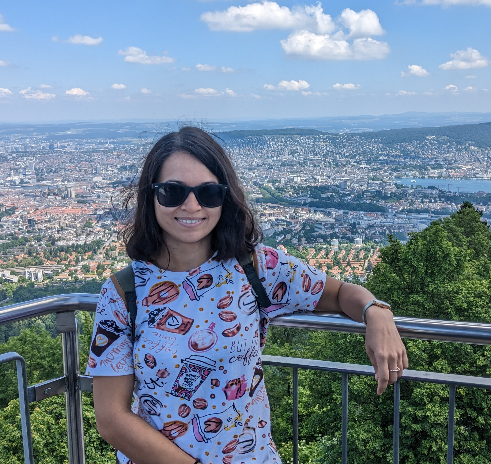

Welcome to my Personal Website. Currently, I am a Postdoctoral Researcher at Dipartimento di Matematica, Università di Pisa. 

# About Me

## Past Professional Experience
* Visiting Fellow, School of Mathematics, Tata Institute of Fundamental Research, Mumbai, India. (August 2022 - May 2024) 
* Postdoctoral Reasearcher, Department of Mathematics, IISER-Bhopal, Bhopal, India. (April 2022 - July 2022)

## Education
* Integrated PhD in Mathematics, School of Mathematics, IISER-Thiruvananthapuram, Kerela, India. (2022)
* Bsc in Mathematics from University of Mumbai, Mumbai, India. (2014)

